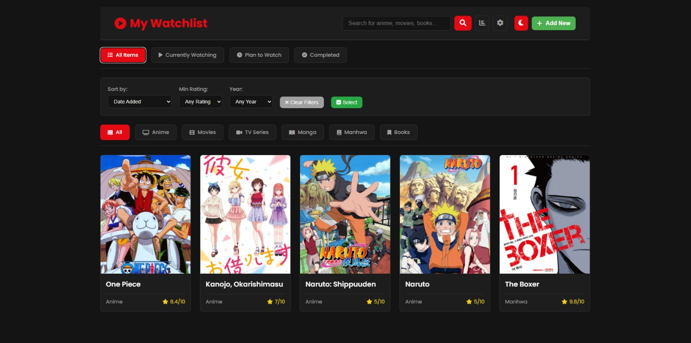
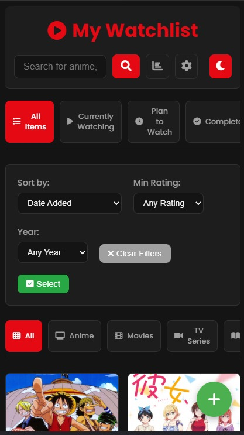

# My Watchlist

My Watchlist, izlediğim ve okuduğum her şeyi (anime, film, dizi, manga ve kitaplar) tek bir yerde toplayan kişisel bir arşiv uygulamasıdır. Bu platform sayesinde listelerimi kolayca yönetebiliyor, yeni keşifler yapabiliyor ve ilerlememi takip edebiliyorum.

**[Uygulamayı Canlı Deneyin](https://legendary-zuccutto-1e32d1.netlify.app/)**

## ✨ Temel Özellikler

- **Geniş Kategori Yelpazesi:** Anime, film, TV dizisi, manga, manhwa ve kitap gibi farklı türlerde içerik ekleme imkanı.
- **Detaylı İzleme:** Her bir içerik için izleme/okuma durumu, ilerleme (bölüm/sayfa), kişisel puanlama ve notlar gibi detaylı bilgiler tutulabilir.
- **Gelişmiş Arama ve Sıralama:** Kapsamlı listeler içinde türe, duruma, puana veya yıla göre anında arama, sıralama ve filtreleme yapılabilir.
- **Otomatik Veri Entegrasyonu:** The Movie Database (TMDB) ve Jikan (MyAnimeList API) entegrasyonu sayesinde yeni içerikler eklenirken poster ve bilgiler otomatik olarak gelir.
- **Kişisel İstatistikler:** Toplam içerik sayısı, tamamlananlar ve ortalama puan gibi istatistiklerle izleme/okuma alışkanlıklarını gösteren bir dashboard.
- **Veri Kontrolü:** Tüm arşiv JSON formatında dışa aktarılabilir ve istenildiğinde geri yüklenebilir.
- **Her Yerde Erişim (PWA):** Uygulama, Progressive Web App (PWA) teknolojisi sayesinde bir masaüstü veya mobil uygulama gibi cihaza kurulabilir ve çevrimdışı erişim sunar.
- **Kişiselleştirilebilir Arayüz:** Açık ve koyu tema seçenekleri.

## 📸 Ekran Görüntüleri




## 🛠️ Teknik Yapı

- **Frontend:** HTML5, CSS3, JavaScript (ES6+)
- **Veri Kaynakları (API):**
    - [The Movie Database (TMDb)](https://www.themoviedb.org/documentation/api)
    - [Jikan API (MyAnimeList)](https://jikan.moe/)
- **Yayınlama (Hosting):** [Netlify](https://www.netlify.com/)
- **Android Paketleme:** [Trusted Web Activity (TWA)](https://developer.chrome.com/docs/android/trusted-web-activity/)

## 🚀 Geliştirme Notları

Bu proje, Netlify üzerinden GitHub ile CI/CD (Sürekli Entegrasyon/Sürekli Dağıtım) prensibiyle çalışır. `main` dalına yapılan her `push` işlemi, web sitesini ve TWA tabanlı Android uygulamasını otomatik olarak günceller.

Yerel ortamda bir değişiklik yaptıktan sonra projeyi güncellemek için izlenen adımlar:

```bash
# 1. Değişiklikleri hazırlama
git add .

# 2. Değişiklikleri kaydetme
git commit -m "Yapılan değişikliği açıklayan bir mesaj"

# 3. Değişiklikleri GitHub'a gönderme
git push
``` 